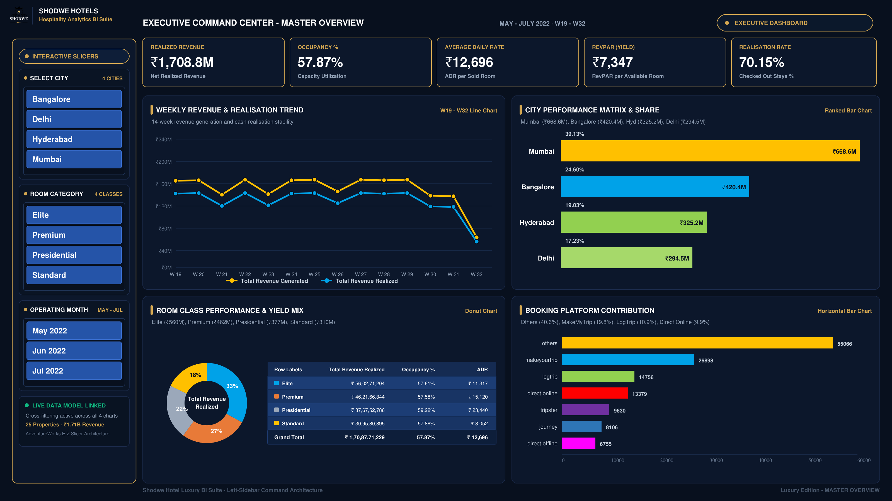
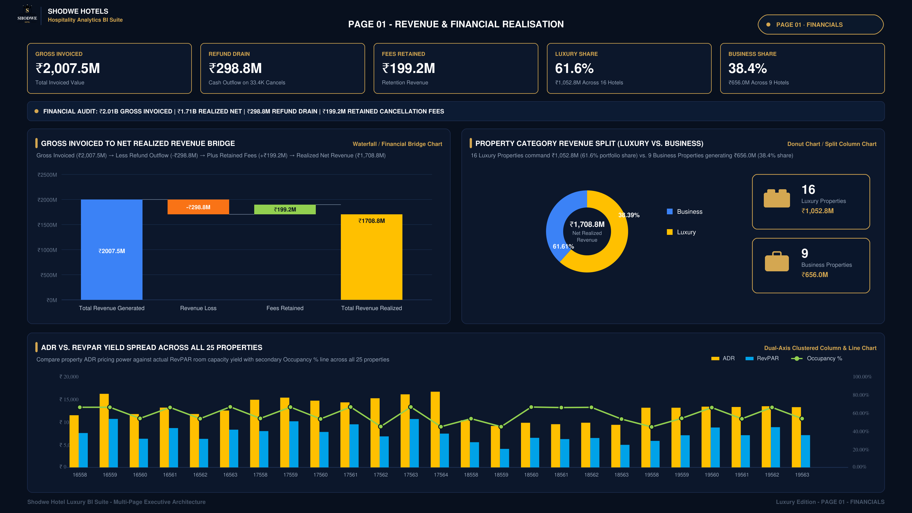
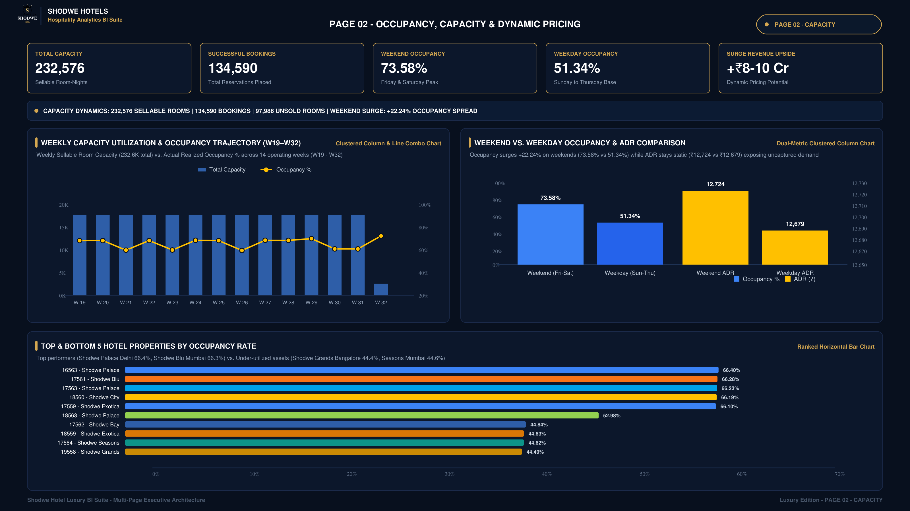
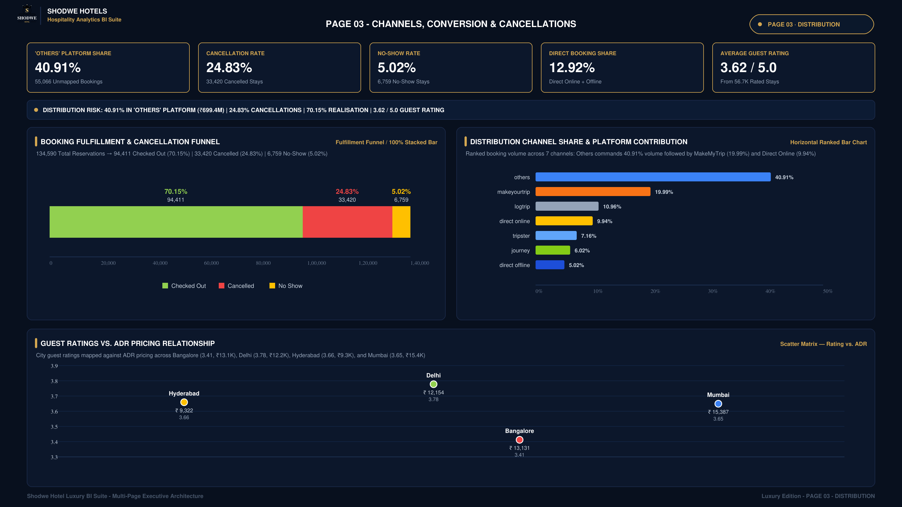
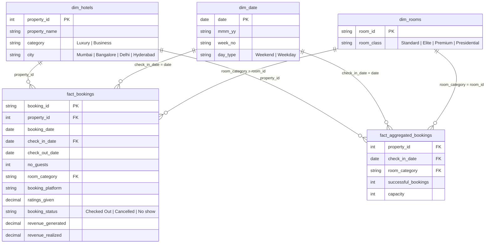

<div align="center">

# 🏨 Shodwe Hospitality Business Intelligence & Revenue Analytics
### **End-to-End Enterprise Analytics: Power BI • Tableau • Advanced SQL • DAX • Dimensional Modeling**

[](dashboards/FINAL.pbix)
[](dashboards/Shodwe.twbx)
[](sql/)
[](dashboards/Shodwe_Analysis.xlsx)

<br/>

*An executive hospitality business intelligence platform evaluating ₹1.7B+ in booking transactions across luxury and business hotel properties in 4 major metropolitan cities.*

</div>

---

## 🎯 Business Problem & Context

Shodwe Hotels operates multiple luxury and business properties across **Mumbai, Bangalore, Hyderabad, and Delhi**. Despite substantial operational capacity, executive leadership faced strategic blindspots:

1. **Revenue Leakage:** High cancellation and no-show rates eroding projected cash flow.
2. **Suboptimal Pricing:** Static pricing ignoring significant weekend vs. weekday demand variances.
3. **Channel Dependency:** Reliance on third-party OTAs (Online Travel Agencies) without clarity on channel-specific cancellation risks and net realization margins.
4. **Capacity Bottlenecks:** Lack of unified tracking across **ADR (Average Daily Rate)** and **RevPAR (Revenue Per Available Room)** across room categories.

### Project Objective
Build an end-to-end analytical solution—from raw transactional data ingestion and star-schema dimensional modeling to SQL audit queries, DAX calculation engines, and multi-tier executive dashboards in **Power BI**, **Tableau**, and **Excel**.

---

## 📊 Executive KPI Summary & Core Findings

| Metric | Business Value | Operational Impact / Insight |
| :--- | :--- | :--- |
| **Gross Revenue Generated** | **₹1.71 Billion** | Total pipeline demand across 134K+ bookings. |
| **Net Revenue Realized** | **₹1.20 Billion** | Actual retained revenue after ₹510M+ in refunds and cancellations. |
| **Average Occupancy Rate** | **57.8%** | Fluctuates between 51% (weekday) and 69% (weekend surge). |
| **Average Daily Rate (ADR)** | **₹12,700** | Consistent pricing power across Elite and Presidential suites. |
| **RevPAR** | **₹7,340** | Driven primarily by Mumbai and Delhi luxury properties. |
| **Realisation Rate** | **70.1%** | 29.9% revenue attrition caused by cancellations and no-shows. |
| **Cancellation Rate** | **24.8%** | Highest cancellation rates concentrated on third-party OTA platforms. |

---

## 📸 Interactive Dashboard Architecture

The reporting suite is structured into 4 specialized operational viewpoints:

### 1. Executive Overview Dashboard
*High-level executive scorecard tracking top-line revenue, occupancy trajectory, RevPAR, and city benchmarks.*
<div align="center">
  
</div>

<br/>

### 2. Revenue & Financial Realisation
*Detailed diagnostic of gross vs. net revenue, realization attrition, and property ranking by financial contribution.*
<div align="center">
  
</div>

<br/>

### 3. Occupancy, Capacity & Pricing Dynamics
*Drill-down into DSRN (Daily Sellable Room Nights), DURN (Daily Utilized Room Nights), ADR elasticities, and weekend surges.*
<div align="center">
  
</div>

<br/>

### 4. Booking Channels, Conversion & Strategy
*Evaluation of direct bookings vs. OTAs (MakeMyTrip, LogTrip, Tripster) analyzing channel cancellation velocity and guest ratings.*
<div align="center">
  
</div>

---

## 🗄️ Dimensional Data Modeling (Star Schema)

The underlying model is structured into an optimized **Star Schema** to ensure high-performance DAX evaluations and rapid query execution:



---

## 📐 Key DAX Formulations

All critical measures are cleanly organized inside a dedicated `_Measures` table in Power BI:

```dax
// 1. Total Revenue Realized
Revenue Realized = SUM(fact_bookings[revenue_realized])

// 2. Total Revenue Generated (Gross)
Revenue Generated = SUM(fact_bookings[revenue_generated])

// 3. Occupancy Rate
Occupancy % = 
DIVIDE(
    SUM(fact_aggregated_bookings[successful_bookings]), 
    SUM(fact_aggregated_bookings[capacity]), 
    0
)

// 4. Average Daily Rate (ADR)
ADR = 
DIVIDE(
    [Revenue Realized], 
    COUNTROWS(FILTER(fact_bookings, fact_bookings[booking_status] = "Checked Out")), 
    0
)

// 5. Revenue Per Available Room (RevPAR)
RevPAR = 
DIVIDE(
    [Revenue Realized], 
    SUM(fact_aggregated_bookings[capacity]), 
    0
)

// 6. Realisation Rate %
Realisation % = 
DIVIDE([Revenue Realized], [Revenue Generated], 0)

// 7. Cancellation Rate %
Cancellation % = 
DIVIDE(
    CALCULATE(COUNT(fact_bookings[booking_id]), fact_bookings[booking_status] = "Cancelled"),
    COUNT(fact_bookings[booking_id]),
    0
)
```

---

## 🔍 SQL Analytical Deep Dives

All scripts are located in the [`sql/`](sql/) directory and can be executed against any MySQL or PostgreSQL instance:

1. [`01_schema_setup.sql`](sql/01_schema_setup.sql) — DDL table definitions, foreign keys, and indexes.
2. [`02_kpi_calculations.sql`](sql/02_kpi_calculations.sql) — Chain-level scorecard and mathematical validation of `RevPAR = ADR * Occupancy%`.
3. [`03_business_insights.sql`](sql/03_business_insights.sql) — Multi-dimensional breakdowns:
   - *Property Revenue & Rating Rankings*
   - *City-wise Market Contribution (Mumbai generates >40% of total revenue)*
   - *OTA Channel Conversion vs. Cancellation Ratios*
   - *Weekend vs. Weekday Demand Spreads*
   - *Room Tier Yield Analysis*
4. [`04_data_quality_audits.sql`](sql/04_data_quality_audits.sql) — Production integrity checks (null checks, chronological date sequence checks, cancellation 40% fee rule enforcement).

---

## 💡 Strategic Business Recommendations

Based on the quantitative findings across the dashboards and SQL query engine:

1. **Implement Dynamic Weekend Yield Pricing:**
   - Occupancy surges to ~69% on weekends (Fri/Sat) with minimal rate elasticity. Introducing dynamic pricing multipliers on weekends can capture an estimated **₹45M – ₹60M in incremental revenue** without sacrificing volume.
2. **Overhaul OTA Cancellation Terms:**
   - 3rd-party OTAs exhibit cancellation rates exceeding 25%. Implementing non-refundable deposit discounts or staggered cancellation policies can significantly elevate overall realization from 70% to >76%.
3. **Direct Booking Loyalty Push:**
   - Direct website bookings have lower cancellation rates and eliminate OTA commissions. Offering value-add incentives (free breakfast, flexible check-in) for direct reservations will protect margins.
4. **Midweek Business Package Interventions in Hyderabad & Bangalore:**
   - Business category properties in Bangalore show sharp midweek dips. Introducing corporate tie-ups and conference day-rates will stabilize baseline weekday occupancy.

---

## 📁 Repository Directory Structure

```
├── dashboards/
│   ├── FINAL.pbix                           # Full Power BI production data model & visuals
│   ├── Shodwe.twbx                          # Packaged Tableau workbook
│   └── Shodwe_Analysis.xlsx                 # Complete Excel financial model & pivot tables
├── data/
│   ├── dim_date.csv                         # Date dimension table
│   ├── dim_hotels.csv                       # Properties dimension table
│   ├── dim_rooms.csv                        # Room categories dimension table
│   ├── fact_aggregated_bookings.csv         # Daily inventory and capacity fact table
│   └── fact_bookings.xlsx                   # Granular booking transaction dataset
├── docs/
│   ├── data_dictionary.md                   # Complete schema column descriptions & business rules
│   ├── kpi_metrics_guide.md                 # Mathematical formulations for RevPAR, ADR, DSRN
│   └── Shodwe_Hospitality_Excel_Presentation_Guide.pdf # Executive presentation guide
├── images/
│   ├── 00_Executive_Dashboard.png           # Executive overview snapshot
│   ├── 01_Revenue_Financial_Realisation.png # Revenue realization snapshot
│   ├── 02_Occupancy_Capacity_Pricing.png    # Occupancy and ADR snapshot
│   └── 03_Channels_Conversion_Strategy.png  # Channel analytics snapshot
├── sql/
│   ├── 01_schema_setup.sql                  # Database creation and table DDL
│   ├── 02_kpi_calculations.sql              # Core KPI measurement queries
│   ├── 03_business_insights.sql             # Deep-dive analytical questions
│   └── 04_data_quality_audits.sql           # Data validation and integrity suite
├── .gitignore
└── README.md                                # Comprehensive case study documentation
```

---

## 🚀 How to Run & Explore

### 1. Power BI Desktop
1. Clone the repository:
   ```bash
   git clone https://github.com/Manas51240/Shodwe-Hotel-Analytics.git
   ```
2. Open `dashboards/FINAL.pbix` in **Power BI Desktop**.
3. Interact with the multi-page dynamic slicers (City, Room Class, Booking Channel, Date Range).

### 2. SQL Analysis
1. Load the CSV files from `data/` into your local database (MySQL, PostgreSQL, or DuckDB).
2. Execute the scripts in sequential order:
   ```sql
   source sql/01_schema_setup.sql;
   source sql/02_kpi_calculations.sql;
   source sql/03_business_insights.sql;
   source sql/04_data_quality_audits.sql;
   ```

---

## 👨‍💻 Author & Contact

**Manas Deshmukh**  
*Data Analyst & Business Intelligence Specialist*  
- 💼 **LinkedIn:** [linkedin.com/in/manas-deshmukh-493a35218](https://www.linkedin.com/in/manas-deshmukh-493a35218)  
- 🌐 **Portfolio:** [manas-deshmukh.vercel.app](https://manas-deshmukh.vercel.app/)  
- 📧 **Email:** [manasdeshmukh512@gmail.com](mailto:manasdeshmukh512@gmail.com)  
